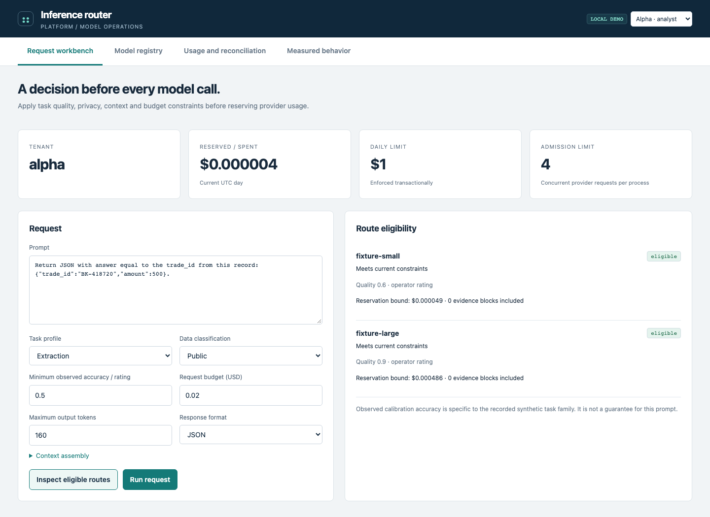
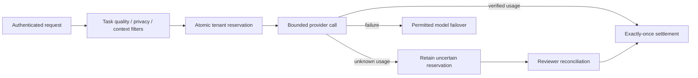

# Inference router

[](https://github.com/christianwhollar/inference-router/actions/workflows/ci.yml)

A local-model gateway with task-specific route eligibility, privacy filters, context assembly, transactional budget reservations, failover, and an operations console. An uncertain provider charge stays visible until a reviewer reconciles it.



## Start locally

Python 3.12 is the tested runtime. From this repository:

```bash
python3.12 -m venv .venv
source .venv/bin/activate
pip install -c constraints.txt -e '.[dev]'
python -m router.serve --demo
```

Open **http://127.0.0.1:8104**. Demo mode binds to loopback and exposes explicit analyst/reviewer identities for synthetic data. It is opt-in; use configured credentials for a hosted service. Interactive API documentation is at `/docs`.

## Workbench flow

1. Compose a request with a task profile, privacy class, quality floor, context blocks, and budget.
2. Inspect every model's eligibility and exclusion reasons before making a call.
3. Run the request and inspect selected model, attempts, token usage, reservation and request IDs.
4. Open **Usage and reconciliation**. If provider usage is unknown, an independent reviewer can record verified usage and release the unused bound exactly once.

The default local demo uses conspicuously labeled offline fixtures. For real inference:

```bash
ollama pull qwen2.5:3b
ollama pull qwen2.5-coder:14b
python -m router.serve --demo --models config/models.calibrated.json
```

The calibration configuration uses zero provider tariffs for local inference. Hardware and electricity costs are not estimated. Configure actual provider pricing separately before interpreting the accounting units as real charges.

## Request and accounting lifecycle



The quota store and reservation journal share a transaction. Successful calls settle verified token usage. Timeouts, malformed outputs and client cancellation retain uncertain reservations. A restarted process retains the journal. Repeated identical settlement is idempotent; a contradictory settlement is rejected. Active calls cannot be manually reconciled until the maximum call window has safely elapsed.

SQLite supports a local instance. Setting `ROUTER_DATABASE_URL` uses PostgreSQL with atomic quota updates and row-locked settlements across replicas. The cache and circuit breakers remain process-local. Half-open circuits admit one probe in a process.

Context blocks are sorted by priority and deduplicated under a conservative UTF-8 byte bound, then marked as untrusted evidence. This is not a tokenizer. JSON responses can be validated against a bounded, self-contained JSON schema. There is a four-request provider concurrency limit, one-second admission timeout and at most three model attempts.

## Calibrate instead of guessing

```bash
python -m router.calibration --output runtime/calibration
python -m router.serve --demo --models runtime/calibration/models.json
```

The study records two actual local models on extraction, arithmetic and policy tasks, with 20 calibration and 20 held-out examples per task/model. Only calibration accuracy and latency enter the routing profile; holdout results remain evaluation evidence. Profiles are tied to installed model digests. General-purpose quality remains an explicitly labeled operator rating.

The schema-constrained study scored 100% held-out identifier extraction for both models (20 examples each). Held-out arithmetic accuracy was 0% for the 3B model and 5% for the 14B model; policy accuracy was 55% and 70%, respectively. At a 90% requested quality threshold, both arithmetic and policy routes are rejected. These small synthetic suites describe these prompts and model builds, not general capability.

[Protocol 1](reports/calibration-v1/report.json) is retained as a failed development run: JSON mode alone frequently produced the wrong response keys. Protocol 2 enforced the answer schema and used fresh calibration/holdout seeds. Schema compliance fixed the response contract; it did not fix reasoning errors.

Twenty examples per task is a small calibration set, and these are synthetic task families. A profile is not a universal model-quality guarantee. The API exposes that distinction.

## Failure and concurrency study

The controlled provider test sends **240 requests with 24 concurrent clients** through a gateway limited to four provider calls. It injects timeouts, measures failover and latency, reconciles unknown usage, repeats settlement attempts, and reopens the database to verify persistence.

```bash
python -m router.reliability --output runtime/reliability.json
```

[Recorded reliability results](reports/reliability-v2.json) · [Live task calibration](reports/calibration-v2/report.json) · [Accounting race and cancellation tests](tests/test_accounting.py)

## Deploy

`docker compose up --build` starts the offline loopback demo. The non-root image also supports a real configuration through environment variables. `infra/` contains Terraform for private ECS/Fargate tasks, TLS load balancing, secret references, logs and a shared database configuration. Terraform was validated; AWS resources were not deployed. Provisioning requires an actual VPC, subnets, certificate, database and model endpoint.


The live three-service verification passed with actual Ollama responses, authorized policy retrieval, independent review enforcement and settled usage reservations. [Recorded connected workflow](reports/integration-v2.json).

The provider adapter omits string-length limits from Ollama's generation grammar because the tested sampler rejects some bounded-string schemas. The complete original JSON Schema is still enforced on the returned output before acceptance.

## Validation and project notes

```bash
pytest -q
ruff check src tests scripts
```

[Architecture and decisions](docs/design.md) · [Operating guide](docs/operations.md) · [Verification record](docs/verification.md) · [Development provenance](DEVELOPMENT.md)

This is a finished local portfolio application with reproducible experiments and recorded limitations. It does not claim prior production deployment or substitute for operating experience.
