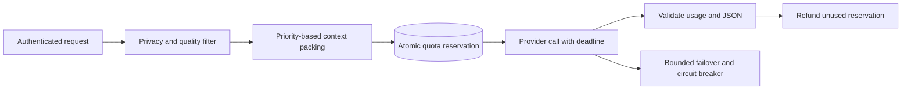

# Inference router

[](https://github.com/christianwhollar/inference-router/actions/workflows/ci.yml)

A shared inference service that selects an eligible model under privacy, quality-rating, context, and cost constraints. It reserves a tenant budget before calling a provider and keeps conservative charges for requests whose final billing is unknown.

This is a runnable reference implementation using synthetic data. See [design notes](docs/design.md), [development provenance](DEVELOPMENT.md), and [verification](docs/verification.md).

## Run locally

Python 3.12 is the tested runtime.

```bash
python3.12 -m venv .venv
source .venv/bin/activate
pip install -c constraints.txt -e '.[dev]'
python -m router.demo
pytest -q
```

## Routing contract



The offline demo uses labeled fixture providers. A real adapter calls Ollama's HTTP API, including JSON mode. Model ratings and prices are operator configuration; they are not guaranteed answer quality or a live pricing feed.

```bash
APP_DEMO=1 uvicorn router.api:app --host 127.0.0.1 --port 8104
curl http://127.0.0.1:8104/v1/complete \
  -H 'Authorization: Bearer demo-analyst' -H 'Content-Type: application/json' \
  -d '{"prompt":"Explain settlement discrepancies","max_output_tokens":128,"budget_usd":0.02,"minimum_quality":0.5}'
```

## Use a real model

Install an Ollama model, update [config/models.ollama.json](config/models.ollama.json) to its exact name, and restart:

```bash
APP_DEMO=1 MODELS_CONFIG=config/models.ollama.json \
  uvicorn router.api:app --host 127.0.0.1 --port 8104
```

The sample configuration names a small model but does not download it. [The live provider smoke record](reports/local-provider-smoke.json) identifies the different installed model used during verification. `response_format:"json"` requests valid JSON. `contexts` accepts objects with `source`, `text`, and `priority`. Duplicate passages are removed and whole passages are selected within a conservative byte-based budget.

## Quotas and scaling

The default SQLite ledger is appropriate for one node. Set `ROUTER_DATABASE_URL` to use a shared PostgreSQL quota ledger across replicas. Tests race reservations across distinct ledger instances to check the hard daily limit. `DAILY_BUDGET_USD` defaults to 1 per tenant per UTC day.

Cache entries are scoped to tenant, user, role, request, and model configuration. Cache hits are not charged. The cache and circuit breakers are bounded process-local structures; replicas do not share them. Four concurrent provider calls are allowed per process. Queue waits and provider calls have deadlines, and a request attempts at most three candidates.

`GET /usage` reports reserved-or-spent cost. `GET /metrics` exposes authenticated Prometheus counters/histograms. OpenTelemetry exports spans when an OTLP endpoint is configured; prompts and credentials are not attached to spans. `/health` checks process liveness and `/ready` checks the quota database.

## Deployment

`docker compose up --build` runs a loopback-only fixture demo. [infra](infra/) contains a Terraform ECS/Fargate deployment with TLS termination, private tasks, Secrets Manager references, CloudWatch logs, immutable image digests, two replicas, and deployment rollback. The Terraform configuration was initialized and validated; no cloud resources were provisioned. [Deployment notes](infra/README.md) list the required existing network, database, certificate, model endpoint, and secret.
